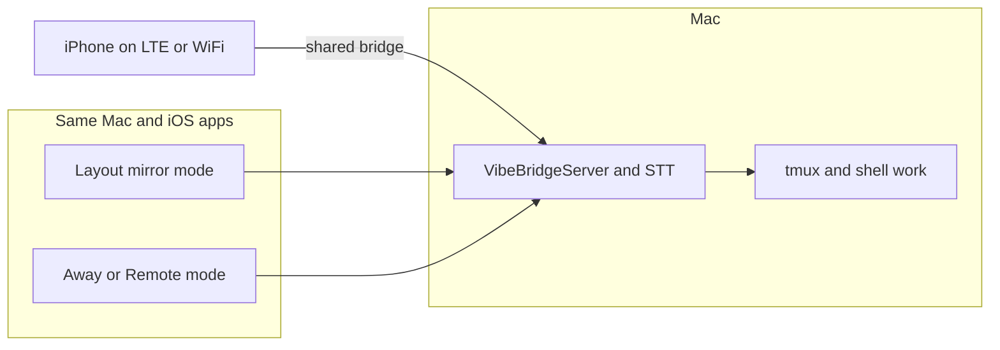

# Plan: "Away" mode next to VibeWindowManager

**Summary:** Add an "away / remote" capability **beside** the current layout mirror and WebSocket bridge: same macOS and iOS apps, shared transport, new UX and optional protocol work for reconnection, Tailnet-first use, and voice-first workflows. **Do not** remove or replace the existing mirror, tiles, or tmux text path.

## Overview

| | |
|---|--|
| **Working name** | "Away" (or Remote) |
| **Repos** | Same [VibeWindowManager](../) (macOS) + sibling [VibeWindowManagerIOS](https://github.com/Tguntenaar/VibeWindowManagerIOS) (iOS); no new app required for v1. |
| **Transport** | One WebSocket to the existing bridge; extend [PROTOCOL.md](PROTOCOL.md) only as needed. Second port only if a future feature (e.g. dedicated binary audio) needs it. |
| **Pixel desktop** | Not in v1. Optional follow-up: deep link to VNC / Screen Sharing app; in-app VNC is out of scope for this plan. |
| **Security** | v1: same model as today (tailnet + trusted use); `wss` + pairing documented as a follow-up. |

## What stays unchanged

- **Layout mirror**, **window tiles**, **Ghostty app query**, **Accessibility** focus/resize, **CLI** — primary "at-desk" experience.
- **WebSocket** on port `19842`, **Bonjour** `_vibewm._tcp`, existing message types in [PROTOCOL.md](PROTOCOL.md) (layout, select, paste, tmux, transcribe, etc.).
- **tmux text capture** — remains the low-bandwidth way to read terminal output without pixel streaming.

"Next to" here means: a **second product surface** in the same app binaries (tabs/sections), sharing the same network stack when possible.

## Target experience

- The user opens the iOS app and either uses **today’s full-screen mirror** or switches to **Away**: optimized for **reconnection**, **Tailnet hostname**, **voice control**, and **tmux / text feedback** without relying on full window geometry.
- **Continuity on return to the Mac:** work stays in **tmux, files, and projects** on the machine; the phone was a remote control, not the source of truth.

## Phases

### Phase 1 — Entry point and layout (iOS + docs)

- **Mode switch** at top level: e.g. **Mirror** (default) vs **Away**. Mirror keeps the current tile UI. **Away** is a simplified screen: connection status, tmux readout, voice affordance, tmux **Refresh** / **Auto** — without duplicating the full tile map unless a minimal preview is desired.
- **Refactor** iOS `ContentView` ([companion app](https://github.com/Tguntenaar/VibeWindowManagerIOS)) so mirror vs away are **separate** top-level containers (`enum` + `Group`, or `TabView` / `Picker`), not interleaved.
- **Docs:** add [REMOTE_AWAY.md](REMOTE_AWAY.md) (when to use Mirror vs Away, Tailscale on both, cellular). Link from the main [README.md](../README.md). This file ([NEW_FEATURE.md](NEW_FEATURE.md)) is the high-level plan; extend [RESEARCH_GHOSTTY_PHONE_REMOTE.md](RESEARCH_GHOSTTY_PHONE_REMOTE.md) as needed.

### Phase 2 — Resilience: reconnect, heartbeat, tailnet-first

- **BridgeClient** (iOS): **automatic reconnect** on disconnect with **backoff** when in Away or when a **"Stay connected"** (or similar) setting is on; keep existing disconnect behavior in Mirror if appropriate.
- **Protocol:** you already have **ping/pong** — define **client** periodic ping in Away (e.g. every 20–30s), **server** pong, and use it for **live / latency** in the UI.
- **Connect order:** Tailnet host first when the field is set; Bonjour for same-LAN. Document; no breaking protocol change if only timing/client behavior.

### Phase 3 — Voice-first in Away

- Reuse **transcribe** and Mac [VibeBridgeServer.swift](../VibeWindowManager/VibeBridgeServer.swift) STT + iOS `transcribe` client messages.
- **Away** UI: push-to-hold or tap-to-start/stop, stream PCM in chunks; show STT result and errors; optional **paste to terminal** (default on) via existing `pasteText` path.
- **Background:** document iOS limitations for long background; v1 = **foreground** + **short** audio while active.

### Phase 4 (optional) — Pixel handoff, not in-app

- **Away** screen: **View screen (VNC)** / Screen Sharing: copy Mac tailnet address, one-line instructions, optional `vnc://` or open third-party **viewer** — **not** in-app VNC in this plan.

## Testing and acceptance

- **Manual:** iPhone on **cellular**, Mac at home on Wi-Fi, **Tailscale** only: connect, tmux readout, one voice round-trip, reconnect after a short **lock** or **airplane** toggle.
- **Automated:** unit tests for pure helpers only (e.g. reconnect backoff, ping interval); no CI on real tailnet/tmux.

## Out of scope for this plan

- Replacing the **layout engine** or **removing** mirror mode.
- **In-app** VNC / WebRTC full-screen **pixel** streaming.
- **wss** + pairing (follow-up; align with your other project docs if useful).
- A **separate** App Store app (optional later fork for marketing).

## Suggested file touch map

| Area | Files (indicative) |
|------|--------------------|
| iOS entry / mode | `VibeWindowManagerIOS/ContentView.swift`, optional new `AwayModeView.swift` |
| iOS network | `VibeWindowManagerIOS/BridgeClient.swift` |
| Mac server | `VibeWindowManager/VibeBridgeServer.swift` |
| Protocol | `VibeWindowManager/BridgeProtocolModels.swift`, [docs/PROTOCOL.md](PROTOCOL.md) (if needed beyond ping cadence) |
| Docs | [REMOTE_AWAY.md](REMOTE_AWAY.md) (new), this file, [README.md](../README.md) |

## Implementation checklist (from roadmap)

- [ ] Add **Mirror** vs **Away** entry in iOS; stub **Away** with connection + tmux + voice on existing bridge.
- [ ] **BridgeClient:** auto-reconnect with backoff; optional ping in Away; status in UI.
- [ ] **Away** voice: PTT/record UI → existing transcribe + paste; show errors and transcript clearly.
- [ ] **Docs:** [REMOTE_AWAY.md](REMOTE_AWAY.md), README link, [PROTOCOL.md](PROTOCOL.md) note for keepalive if you formalize intervals.
- [ ] **Optional:** Away button: copy tailnet host + open VNC viewer (no in-app VNC).

---

*This plan keeps VibeWindowManager as the app you have today, with **Away** as a parallel lane for using the phone away from the desk without rewriting the core mirror experience.*
